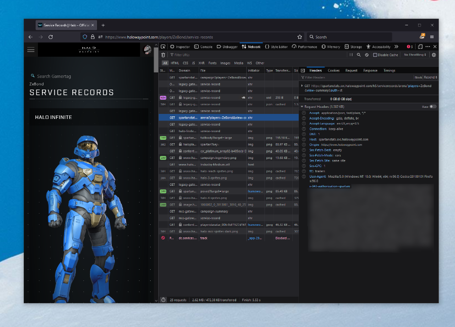
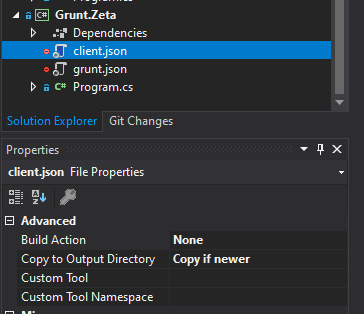

<div align="center">
	
	<h1>🪐 Grunt API</h1>
	<p>
		<b>The unofficial, reverse-engineered Halo Infinite web API</b>
	</p>
	<br>
</div>

Welcome to **Grunt API** - the unofficial way to use official Halo Infinite APIs. Here be **a lot of dragons** and this is not yet ready to be a standalone package, since the changes will be frequent and large. That said, you can use it as a test pad for your own explorations.

This API enables you to:

- Get stats on matches you played.
- Get your personal player stats.
- Track campaign progress.
- Track map popularity

And more!

>**Current stable package ETA:** February 2022

## Table of contents

- [Components](#components)
- [Setup & usage](#setup--usage)
	- [Bring your own token](#bring-your-own-token)
	- [Authenticate yourself](#authenticate-yourself)
- [Endpoints](#endpoints)
- [Documentation](#documentation)
- [FAQ](#faq)
- [Contributions](#contributions)

## Components

| Component | Description |
|:----------|:------------|
| [`Grunt`](https://github.com/dend/grunt/tree/main/Grunt/Grunt) | The core library, written in C#, that wraps the Halo Infinite web APIs. |
| [`Grunt.Zeta`](https://github.com/dend/grunt/tree/main/Grunt/Grunt.Zeta) | Experimental ground for the Grunt library. This will eventually become the Grunt CLI. |
| [`Grunt.Librarian`](https://github.com/dend/grunt/tree/main/Grunt/Grunt.Librarian) | Tool used to auto-generate code stubs for Halo Infinite API endpoints. It's a very "brute"-ish way to generate the code, but it works for now. |

## Setup & usage

The core requirement to use the endpoints in the library is to have a Spartan token, that is provided by the Halo Infinite service. That being said, there are two ways to experiment with the library:

1. **Bring your own Spartan token**. That means that you can obtain it on your own through man-in-the-middle inspection of the app/game traffic, or by grabbing it from the [Halo Waypoint](https://halowaypoint.com) site. Read more on that in the [section below](#bring-your-own-token).
2. **Executing the full authentication flow yourself.** This is a bit more complex, but doable because Grunt API wraps all the required methods out-of-the-box. For details, see [section below](#authenticate-yourself).

### Bring your own token

If you want to bring your own token, you carry the responsibility of acquiring and getting an up-to-date version of the Spartan token (they do expire frequently). The easiest way to do that is by looking at the [Halo Waypoint site](https://halowaypoint.com) through the lens of your browser's Network Inspector.

Look for API calls that return JSON data, and in some of the request headers you will notice a particularly interesting one - `x-343-authorization-spartan`. That's what you need.

 

I'll say it again - this token is not long-lived and if you see calls failing with `401 Unauthorized`, that means you need a new token.

Some API calls are also requiring you include another header - `343-clearance`. This token is obtained through a separate API call that I am yet to document, but you can also grab it from the Halo Waypoint site. An example API call that you can watch for with the Synthwave event going on is this:

```bash
https://gamecms-hacs-origin.svc.halowaypoint.com/hi/Progression/file/ChallengeContent/ClientChallengeDefinitions/S1EventSynthwaveChallenges/Normal/NSynthwaveMedalRevive.json
```

If you look for it in the network inspector, you will get the `343-clearance` header as well. It's on my TODO list to document available endpoints and whether they require clearance or not.

Once you have the Spartan and clearance tokens, you are good to go, and can now call the API endpoints from Grunt.

```csharp
HaloInfiniteClient client = new(<YOUR_SPARTAN_TOKEN>, <YOUR_CLEARANCE_TOKEN>, <YOUR_XUID_REQUIRED_ONLY_FOR_SOME_CALLS>);

// Try getting actual Halo Infinite data.
Task.Run(async () =>
{
    var example = await client.StatsGetMatchStats("21416434-4717-4966-9902-af7097469f74");
    Console.WriteLine("You have data.");
}).GetAwaiter().GetResult();
```

### Authenticate yourself

> **IMPORTANT**: The instructions below are using Visual Studio 2019, but are going to work with Visual Studio 2022, which you can [download for free](https://visualstudio.microsoft.com/thank-you-downloading-visual-studio/?sku=Community&rel=17).

If you want to automatically generate the Spartan token, you can do so with the help of Grunt API without having to worry about doing any of the REST API calls yourself. Before you get started, make sure that you [register an Azure Active Directory application](https://docs.microsoft.com/en-us/azure/active-directory/develop/quickstart-register-app). You will need it in order to log in with your Microsoft account, that will be used to generate the token. Because this is just for you, you can use `https://localhost` as the redirect URI when you create the application, unless you're thinking of productizing whatever you're building.

With the application created, in the `Grunt.Zeta` project create a `client.json` file, that has the following contents:

```json
{
  "client_id": "<YOUR_CLIENT_ID_FROM_AAD>",
  "client_secret": "<YOUR_SECRET_FROM_AAD>",
  "redirect_url": "<YOUR_REDIRECT_URI_FROM_AAD>"
}
```

When you add the configuration file to your project, make sure that it's `Build Action` is set to `None` and `Copy to Output Directory` is `Copy if newer`.



With the file there, you can now run through the authentication flow, that is powered by Grunt's helper methods:

```csharp
ConfigurationReader clientConfigReader = new();
var clientConfig = clientConfigReader.ReadConfiguration<ClientConfiguration>("client.json");

XboxAuthenticationManager manager = new();
var url = manager.GenerateAuthUrl(clientConfig.ClientId, clientConfig.RedirectUrl);

HaloAuthenticationClient haloAuthClient = new();

// You will need to visit this URL and copy the code in the query string
// that is issued when the login is successful.
Console.WriteLine("Provide account authorization and grab the code from the URL:");
Console.WriteLine(url);

Console.WriteLine("Your code:");
var code = Console.ReadLine();

var accessToken = string.Empty;

var ticket = new XboxTicket();
var haloTicket = new XboxTicket();
var extendedTicket = new XboxTicket();

var xblToken = string.Empty;
var haloToken = new SpartanToken();

// First, request the OAuth token from the Live service.
Task.Run(async () =>
{
    var tokens = await manager.RequestOAuthToken(clientConfig.ClientId, code, clientConfig.RedirectUrl, clientConfig.ClientSecret);
    accessToken = tokens.AccessToken;
}).GetAwaiter().GetResult();

// Next, request the user token.
Task.Run(async () =>
{
    ticket = await manager.RequestUserToken(accessToken);
}).GetAwaiter().GetResult();

// Now, also exchange it for an XSTS token.
Task.Run(async () =>
{
    haloTicket = await manager.RequestXstsToken(ticket.Token);
}).GetAwaiter().GetResult();

// Get an extended one as well, so that you can get the user XUID.
Task.Run(async () =>
{
    extendedTicket = await manager.RequestXstsToken(ticket.Token, false);
}).GetAwaiter().GetResult();

// Now, get the XBL3.0 token that is standard for Xbox services.
if (ticket != null)
{
    xblToken = manager.GetXboxLiveV3Token(haloTicket.DisplayClaims.Xui[0].Uhs, haloTicket.Token);
}

// Lastly, exchange it for a Spartan token.
Task.Run(async () =>
{
    haloToken = await haloAuthClient.GetSpartanToken(haloTicket.Token);
    Console.WriteLine("Your Halo token:");
    Console.WriteLine(haloToken.Token);
}).GetAwaiter().GetResult();

```

The code above doesn't account for token refreshes that don't require visiting the login URL every single time you want to plan for an API call - I will be working on showing how it works in `Grunt.Zeta` in the near future.

Once you have the Spartan token, you are good to go and can start issuing API requests.

## Endpoints

Complete list of endpoints can be obtained by querying the official Halo Infinite API, that also helpfully contains all the metadata and requirements for each:

```bash
https://settings.svc.halowaypoint.com/settings/hipc/e2a0a7c6-6efe-42af-9283-c2ab73250c48
```

The endpoint above does not require authentication and can be queried in the open. You can also peruse an offline version of the API response [in the library](https://github.com/dend/grunt/blob/main/Grunt/Grunt/endpoints.json).

## Documentation

This is work in progress. Aiming to have better docs as the library becomes more stable, but in the meantime you can explore the [library code](https://github.com/dend/grunt/tree/main/Grunt/Grunt) - I am including detailed code comments for assets that I've formalized.

## FAQ

**Is this in any way endorsed by 343 Industries?**

No. Not at all. This is something that I've put together myself by inspecting network traffic.

**Something is broken and my production site that uses your library doesn't work. Can you help?**

Don't use any of this code in production. It's nowhere near stable.

**Some API endpoint is not working anymore or returns an unexpected result. What's up with that?**

[Open an issue](https://github.com/dend/grunt/issues) so that I can investigate.

**How do I contact the author?**

[Open an issue](https://github.com/dend/grunt/issues) or reach out [on Twitter](https://twitter.com/denniscode).

## Contributions

Contributions are welcome, but please first [open an issue](https://github.com/dend/grunt/issues) so that we can discuss before writing any code.
